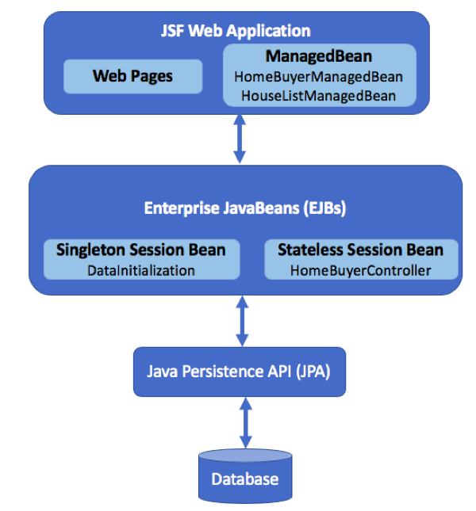
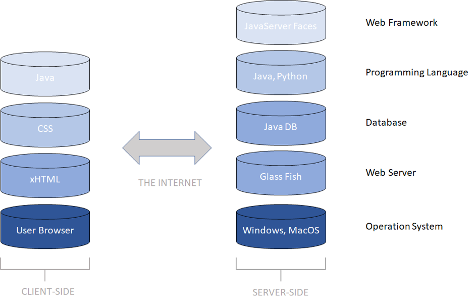

# SmartEvaluator
Smart Evaluator is an online web application, which helps home buyers analyze their financial situation and eligibility to suggest suitable houses to them based on users’ savings, monthly expense, monthly income and age. 

## Assumption: 
1.	Our home property type is limited to condo.
2.	We exclude CPF saving as the input for users but just savings as general.
3.	We only collect house data from 99.co website.
4.	We only consider age, saving, monthly income and monthly expense as factors to analyse users’ eligibility and affordability to buy the house.

## Architecture diagram and Technology Stack

  We use JSF web application, Java, Netbeans, Python and web scraping as framework and programming language to solve this task.

## Algorithm
The house must have a price below 0.8*(personal savings+ total amount of loan he/she can apply). Personal savings are collected directly from the user and the total amount of loan is calculated according to regression analysis.
Another web scraping session is conducted on a loan calculator. The total amount of housing loan that one person can apply for is determined by his/her age, personal savings, monthly income and monthly living expenses. Thousands of trial data is imported into the online loan calculator and the results, which are the amount of data each person can apply for are collected. Thus, a formula to calculate one’s loan that he/she can apply for is created based on regression analysis with an accuracy of 95.7%.

## Data 
A website about Singapore condo information is targeted for web scraping. Selenium driver on Google is used to conduct website traversal and redirection and classic BeautifulSoup is used to locate elements and get information about each condo. Eventually, information about 30k condos are scraped in order to provide user with sufficient source.

## Steps to set up
-	Open the source code in github using netbean IDE. (preferrably 8.2 version)
-	Click on the two Java EE modules to open them (“Inside Netbeans project navigation bar, there is a folder named “Java EE modules”)
-	Import Jar files
1) import  jxl-2.6.12.jar into SmartEvaluator-ejb module.
2) import the rest of 5 jar packages (“redmond-1.0.10.jar”, “xmlbeans-2.6.0.jar”, “itext-2.1.7.jar”, “poi-3.7.jar”, “primefaces-6.1-jar”) into SmartEvaluator-war module.
-	Open Service window, start GlassFish server
-	Change Excel file absolute path in dataInitilizaiton.java line 57.
-	Right click the project directory to build the project.
-	Right click the project directory to deploy the project.
-	Go to localhost:8080/SmartEvaluator-war and start inputting your information!

## New Features:
1. Area and money sorting filter,searching function,and return
2. added repayment years(select from 5,10,15,20,25,30,35)
3. age+repayment years<= 65, otherwise alert
4. input error handling
5. Assumption: over 65 years old cannot loan
6. use R non linear regression to generate formula, variable: max loan, age,monthly income, repayment year 

## Team Information
1. Xu Hong : Frontend (NUS-Inforamtion System)
2. Du Li : Backend and data (SUTD-Information System Technology and Design)
3. Huang Xiangyuan : Backend and data (NUS-Computer Science)
